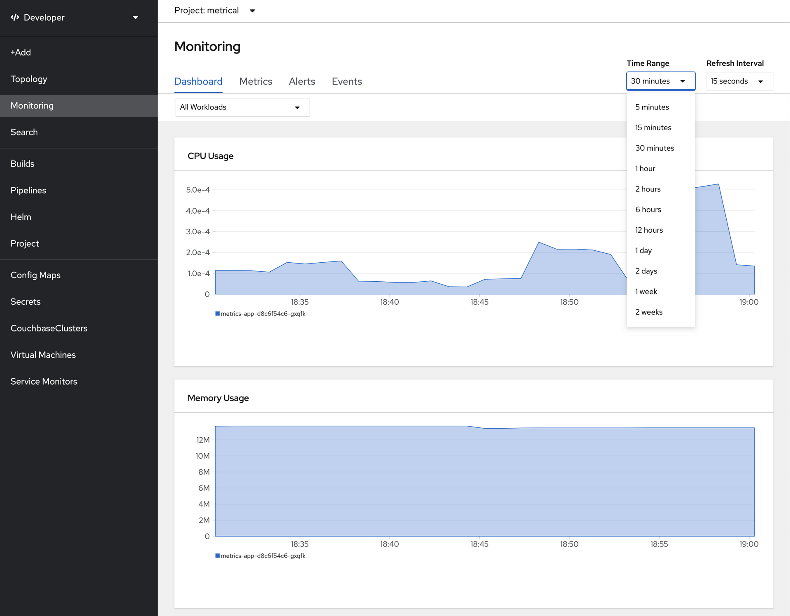
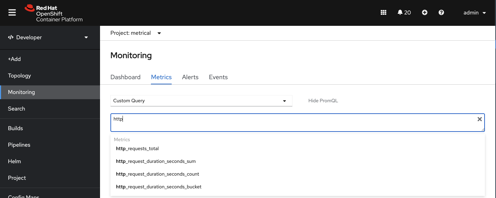
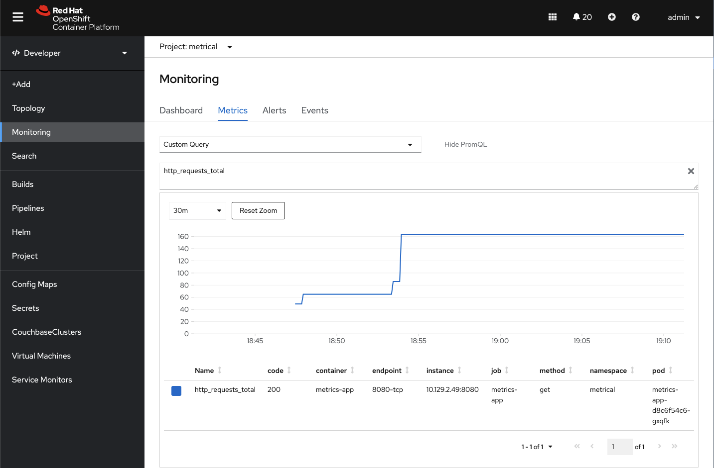
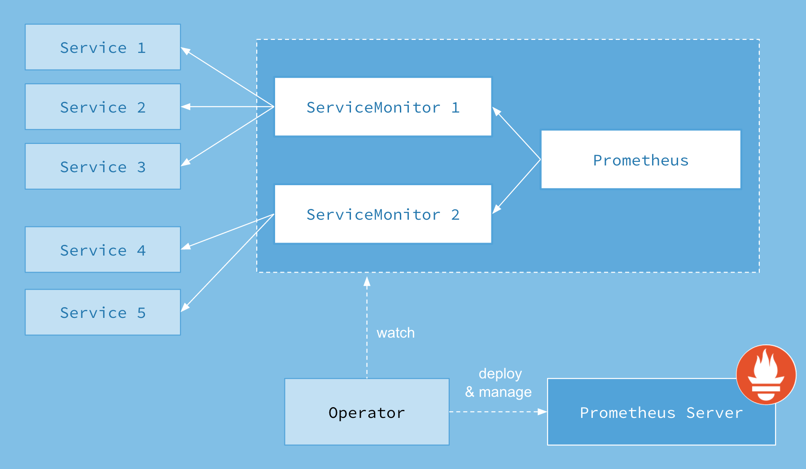

Every new release of OpenShift Container Platform comes with its set of treats for developers, and in the 4.6 release there is a new feature that lets you monitor your own application metrics within the developer console. In this blog post, we'll have an overview of this new capability and show you how to enable it.

**1 - Show me the Mon(ey)itoring!!**

You might probably be familiar with the Monitoring dashboard that shows the pure pod metrics like CPU and Memory usage, Network Bandwidth etc that existed since OpenShift 3 in the console, but if not, here is what it looks like:

With OpenShift 4.6, we've extended this capability to show custom Prometheus metrics from your workloads in the developer console. So as a developer, I can go to the **Monitoring -> Metrics** section and look for a **Custom Query** that is exposed by my application, and then get a rendered graphic in that portion of the UI. Here is an example of that:

The resulting chart for the workload custom metric is shown below:

So with this feature, you are now able to publish your own prometheus metrics endpoints in your applications and easily render them in the developer console.

**2 - That's great, so how does all this work?**

**The Prometheus Operator**

In order to understand how all this works, let's get back to some basics: Operators and CustomResourceDefinitions.
**Operators** are a construct that allows to add custom behavior to Kubernetes/OpenShift by creating custom Controllers that will react to events on Kubernetes resources, for instance when one is created.

**Custom Resource Definitions (CRDs)** allow to extend Kubernetes/OpenShift apis with custom resources, thus allowing to control their lifecycle through the controller.

That is exactly what the Prometheus Operator does in OpenShift. We have a CustomResourceDefinition called "ServiceMonitor" that allows us to quickly says "here are the metrics I want to monitor in Prometheus" and the Controller does what is needed to configure the Prometheus scraping. For an in-depth understanding of the Prometheus Operator and ServiceMonitors please read the [following coreos.com blog post](https://coreos.com/blog/the-prometheus-operator.html)

Your own application needs to expose a Prometheus metrics endpoints (usually /metrics), and then you'll need to create a ServiceMonitor that targets the service that exposes your application workload.

The following diagram shows the relationships between these constructs:

Below is an example of a ServiceMonitor that will be automatically ingested by the Prometheus Controller to create a custom query that will be available in the drop-down list of the OpenShift Developer Console (see beginning of the blog post):

----
apiVersion: monitoring.coreos.com/v1
kind: ServiceMonitor
metadata:
  name: example-monitor
spec:
  endpoints:
  - interval: 30s
    port: 8080-tcp
    scheme: http
  selector:
    matchLabels:
      app: metrics-app
----

**Getting your hands-on: configuring a custom metric**

Hopefully this blog post would have given you an overview of this new feature in OpenShift 4.6 release. 

If you wish to configure a custom metric monitoring for your application, you can find detailed instructions here: https://github.com/redhat-scholars/openshift-admins-devops/blob/v4.6blog/documentation/modules/ROOT/pages/metrics-alerting.adoc

